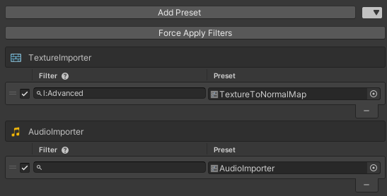

# Folder Importer Presets

This package allows for you to have folder-specific asset importers.



## Installation

#### OpenUPM
```
openupm add com.nomnom.folder-importer-presets
```

#### Package Manager
1. Open the Package Manager (`Window/Package Manager`)
2. Add a package from git URL
3. Input `https://github.com/nomnomab/Folder-Importer-Presets.git`~~~~

## Usage

Presets made through the normal means of preset creation can be added to a `Folder Importer` asset.
- This is located under `Create/Nomnom/Folder Importer`

Once a preset is added, it can be be enabled/disabled, given a filter, and can be changed at any point.
- Empty filters will skip the filter check and directly apply the preset if applicable.

The `Force Apply Filters` is used to force apply all importers under the given directory, as well as any sub-directories.
> Keep in mind, forcing the filter is a destructive operation and can not be reverted.

## Filter Syntax

| Prefix | Keybind | Example |
  |---|---|---|
| n: | File Name | `n:UI_*` |
| e: | File Extension | `e:*.png` |
| t: | Object Type | `t:UnityEngine.Texture2D` |
| l: | Asset Labels | `l:2d,3d,car` |

Filters can also be chained with the `|` symbol
- `n:UI_*|e:*.png|t:UnityEngine.Texture2D`